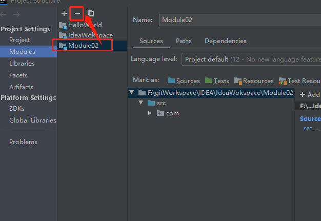

# IntelliJ IDEA

## 一、IDEA介绍

> IDEA全称IntelliJ IEDA，是JAVA编程语言开发的集成环境（与Eclipse竞争）,业界公认的最好的JAVA的开发工具之一。

### 1、主要功能

支持主流语言、框架

### 2、主要优势（较Ecplise）

- 强大的整合能力，如：git，maven，spring等
- 提示功能的快速、便捷
- 提示功能的范围广
- 好用的快捷键和代码模板
- 精准搜索

## 二、IDEA安装、配置和使用

### 1、下载地址

https://www.jetbrains.com/

### 2、配置路径

C:\Users\sayyes\\.IntelliJIdea2019.3\config

### 3、注册激活

- 网上百度
- 购买

### 4、软件设置

根据导航选择自己喜欢的

### 5、插件安装

idea插件下载路径：https://plugins.jetbrains.com/idea

## 三、HelloWorld项目建立

1、File-》New->Project按导航创建一个HelloWorld工程，目录如下


​	注：这里的.idea，HelloWorld.iml是IDEA工程特有的目录和文件

2、src下面创建包com.idea.test

3、创建HelloWorld类

```java
package com.idea.test;

public class HelloWorld {
  public static void main(String[] args) {
    System.out.println("hello world!");
  }
}

```

4、run执行

## 四、IDEA模块

- idea的project相当于eclipse的workspace
- idea的module相当于eclipse的project

eclipse可以在一个workspace下面建立很多project在一个视图显示，在idea无法建立多个project在同一个视图显示，所以需要module来实现。

### 1、以模块重新创建HelloWorld

- 简历IdeaWorkspace的工程
- 在工程下面新建module


### 2、删除Module

右击->Open Modules Settings->选择要删除的按“-“后模块不属于模块管理，然后就可以用delete删除所需模块



## 五、IDEA功能设置

==idea在人性化设置备受推崇==

### 1、进入设置界面

- ToolBar栏位图标进入
- File-》settings进入


### 2、设置的功能

- Appearance & Behavior ：外观和行为
  - 主题（外部下载可以导入）

- Keymap：快捷键

- Editor：编辑

  - 鼠标滚轮放大缩小代码区域

  

  - 设置鼠标放入提示

  

  - 自动导包

  

  - 不区分大小写提示

  

  - 字体设置（大小，颜色等）
  - 代码模板设置
  - 文件统一字符集File Encodeings

- Plugins：插件

- VersionControl：版本控制

- Build,Execution,Deployment：构建、执行、部署

  - 自动编译

  

  - 省电模式（注意：会去掉提示灯功能）

- Languages & Frameworks：语言和框架
- Tools：工具

### 3、快捷键（可以设置Eclipse的快捷键）

这里列的是idea的快捷命令

```java
/**
 * Ctrl+Z：撤销
 * Ctrl+Shift+Z：重做
 * Ctrl+X：剪贴
 * Ctrl+C：复制
 * Ctrl+V：粘贴
 * Ctrl+Y：删除当前行
 * Ctrl+D:复制当前行
 * Ctrl+Shift+J：将选中的行合并成一行
 * Ctrl+N：查找类文件
 * Ctrl+Shift+N：查找文件
 * Ctrl+G：定位到文件某一行
 * Alt+向左箭头：返回上次光标位置
 * Alt+向右箭头：返回至后一次光标位置
 * Ctrl+Shift+Backspace：返回上次编辑位置
 * Ctrl+Shift+反斜杠：返回后一次编辑位置
 * Ctrl+B：定位至变量定义的位置
 * Ctrl+Alt+B：定位至选中类或者方法的具体实现
 * Ctrl+Shift+B:直接定位至光标所在变量的类型定义
 * Ctrl+U：直接定位至当前方法override或者implements的方法定义处
 * Ctrl+F12：显示当前文件的文件结构
 * Ctrl+Alt+F12：显示当前文件的路径，并可以方便的将相关父路径打开
 * Ctrl+H：显示当前类的继承层次
 * Ctrl+Shift+H：显示当前方法的继承层次
 * Ctrl+Alt+H：显示当前方法的调用层次
 * F2：定位至下一个错误处
 * Shift+F2：定位至前一个错误处
 * Ctrl+Alt+向上箭头：查找前一个变量共现的地方
 * Ctrl+Alt+向下箭头：查找下一个变量共现的地方
 * Ctrl+=：展开代码
 * Ctrl+-：收缩代码
 * Ctrl+Alt+=：递归展开代码
 * Ctrl+Alt+-：递归收缩代码
 * Ctrl+Shift+=：展开所有代码
 * Ctrl+Shift+-：收缩所有代码
 * Ctrl+Shitft+向下箭头：将光标所在的代码块向下整体移动
 * Ctrl+Shift+向上箭头：将光标所在的代码块向上整体移动
 * Ctrl+Alt+Shift+向左箭头：将元素向左移动
 * Ctrl+Alt+Shift+向右箭头：将元素向右移动
 * Alt+Shift+向下箭头：将行向下移动
 * Alt+Shift+向上箭头：将行向上移动
 * Ctrl+F：在当前文件中查找
 * Ctrl+R：替换字符串
 * Ctrl+Shift+F:在全局文件中查找字符串
 * Ctrl+Shift+R：在全局中替换字符串
 * Alt+F7：查找当前变量的使用，并列表显示
 * Ctrl+Alt+F7：查找当前变量的使用，并直接对话框提示
 * Ctrl+F7：在文件中查找符号的使用
 * Ctrl+Shift+F7：在文件中高亮显示变量的使用
 * Ctrl+O：重写基类方法
 * Ctrl+I：实现基类或接口中的方法
 * Alt+Insert：产生构造方法，get/set方法等
 * Ctrl+Alt+T：将选中的代码使用if，while，try/catch等包装
 * Ctrl+Shitf+Delete：去除相关的包装代码
 * Alt+/：自动完成
 * Alt+Enter：自动提示完成，抛出异常
 * Ctrl+J：插入Live Template 快速插入一行或者多行代码
 * Ctrl+Alt+J：使用Live Template包装
 * Ctrl+/：使用//注释
 * Ctrl+Shift+/：使用注释
 * Ctrl+Alt+L：格式化代码
 * Ctrl+Alt+I：自动缩进行
 * Ctrl+Alt+O：优化import
 * Ctrl+]：快速跳转至诸如{}围起来的代码块的结尾处
 * Ctrl+[：快速跳转至诸如{}围起来的代码块的开头处
 * Ctrl+Shift+Enter：将输入的if，for，函数等等补上{}或者；使代码语句完整
 * Shift+Enter：在当前行的下方开始新行
 * Ctrl+Alt+Enter：在当前行的上方插入新行
 * Ctrl+Delete：删除光标所在至单词结尾处的所有字符
 * Ctrl+Backspace：删除光标所在至单词开头处的所有字符
 * Ctrl+向左箭头：将光标移至前一个单词
 * Ctrl+向右箭头：将光标移至后一个单词
 * Ctrl+向上箭头：向上滚动一行
 * Ctrl+向下箭头：向下滚动一行
 * Ctrl+W：选中整个单词
 * Ctrl+Shift+U：切换大小写
 * Shift+F6：重命名
 * Ctrl+F6：更改函数签名
 */
```

### 4、模板

settings->Editor

- LiveTemplates（可修改）
- Postfix Completion（不可修改）

1、使用固定输入来生成

2、添加修改

## 六、web工程创建

### 1、新建module

### 2、选择静态/动态web

### 3、Tomcat本地配置

- run-》edit configurations-》"+"按钮新增选择要加的类型
- 设置tomcat名称，还有article（添加、修改名称）
- 运行项目

如果存在tomcat输出日志乱码，调整tomcat的logging.properties配置文件

```properties
#将UTF-8调整为GBK
java.util.logging.ConsoleHandler.encoding = GBK
```

## 七、数据库关联

这里以本机mysql为准

idea最右侧栏位有个Database按钮，点击会展示出来操作界面(驱动包可以在联网直接下载)


## 八、版本管理工具

这里以git为例

1、settings->vesison control进入git进行配置

2、配置好了，使用导航栏VCS，然后选择get from version control（早期版本会叫checkout from version control），然后输入clone的地址，然后clone的本地路径

## 九、断点调试

### 1、debug设置

这里设置为了节省空间，提交性能的设置


### 2、常用断点调试

F5,F6,F7


## 十、Maven工具关联

### 1、本地下载安装，并且配置环境变量

### 2、IDEA的settings-》build、execution、deployment-》Build Tools

- 设置本地maven


- 设置依赖自动添加下载


3、新增案例

- 新建module-》Spring initializr（为例）
- 按导航进行设置建立
- 服务端下载maven包
- 在idea右侧栏位有操作界面-进行清理、编译、打包等操作


## 十一、其他设置

### 1、生成javadoc

Tools-》generate javadoc

编码集：-encoding UTF-8 -charset UTF-8


### 2、缓存和索引的清理

idea会自动创建索引，为了加快文件的查找，从而加快各种查找、代码提示灯操作的速度

操作：File->Invalidate Caches/Restart...

### 3、Idea软件自动更新

取消自动更新


### 4、插件的使用

- 外部下载导入

下载地址：https://plugins.jetbrains.com/idea

如解析json的GsonFormat插件下载

- settings->Plugins里面下载